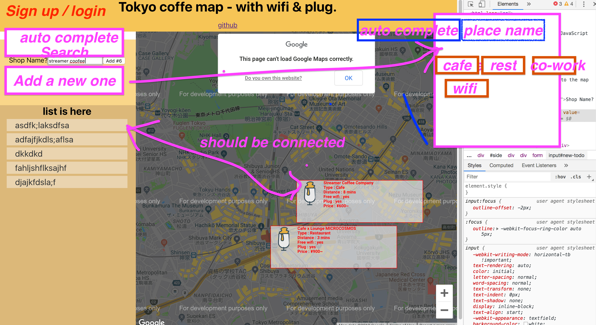

# tokyo-dev-map
A map for working spaces in Tokyo. 

[live project](https://github.com/facebook/create-react-app)

## Contributors

Bryenne -

IJen -

## Project Goal
- Use google map API with React.js

- Add extra information, wifi, plug, price range, etc. on every location.

- Manual location input

- User login, add, edit & delete route

- Input location from API (meetup, etc.)

## Tech Stack
- React

- Node.js

- google API

- ES6

- Auth

- SQLite3

- sass

## Reference

[Pizza-Streat-Full-Website](https://github.com/Rogulik/Pizza-Streat-Full-Website/blob/master/src/locationsPage/components/GoogleMap.js)

[MAIN EXAMPLE](http://google-map-react.github.io/google-map-react/map/main/)

[with google-maps-react](https://codesandbox.io/s/eloquent-cori-jp0l4?fontsize=14&hidenavigation=1&theme=dark)

[with google-map-react](https://www.npmjs.com/package/google-map-react)

[How to use the Google Maps API with React.js](https://dev.to/jessicabetts/how-to-use-google-maps-api-and-react-js-26c2)

[google-maps-services-js](https://github.com/googlemaps/google-maps-services-js)
